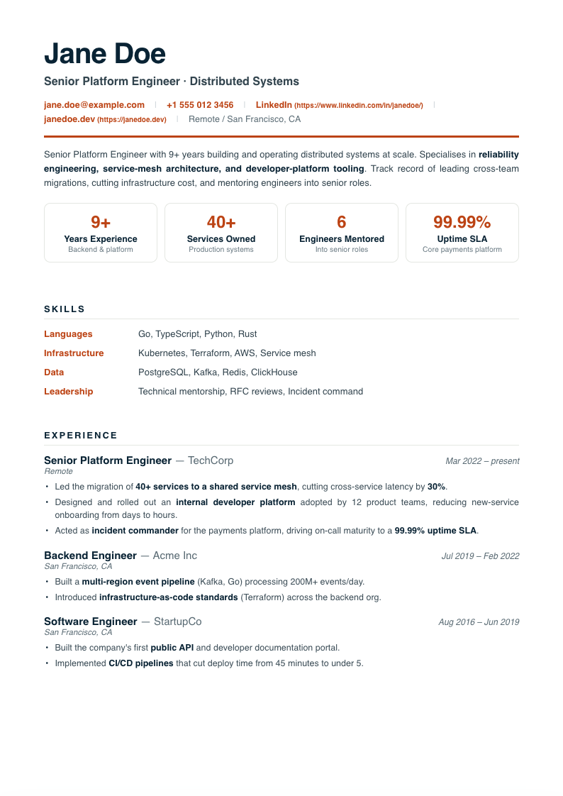
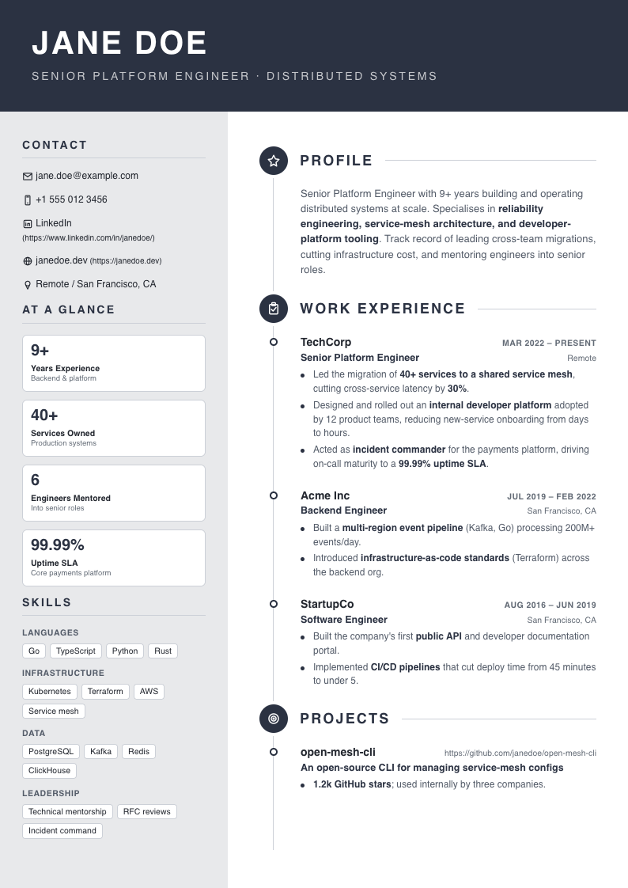

# cv-generator

Generate A4 PDF or HTML CVs from YAML. Content stays in one config; choose a
built-in Handlebars template or write your own. Everything renders locally,
with system fonts by default.

## Quickstart

Requires **Node.js 22.13+**. Use a supported Node 22 or 24 release.

```sh
git clone https://github.com/korczas/cv-generator.git
cd cv-generator
npm ci
npm run vault:init
cd career-vault
git remote add origin <private-repository-url>
git add .
git commit -m "Initialize career vault"
git push -u origin main
```

The initializer creates an ignored, independent Git repository for private career
material. Return to the parent directory, create a tailored YAML file from
`configs/example.yaml`, and render it without moving it into the parent repository:

```sh
cd ..
cp configs/example.yaml career-vault/cvs/my-cv.yaml
npm run generate -- career-vault/cvs/my-cv.yaml
```

Edit the tailored file and regenerate with `--force` to replace existing output.
PDF generation uses the Chromium installed by Puppeteer. For HTML-only use:

```sh
PUPPETEER_SKIP_DOWNLOAD=1 npm ci
npm run generate -- configs/my-cv.yaml --format html
```

On PowerShell set `$env:PUPPETEER_SKIP_DOWNLOAD="1"` before `npm ci`.
If Chromium is missing, run `npx puppeteer browsers install chrome`. Linux may
also require Chromium system libraries and sandbox configuration; see
[Puppeteer troubleshooting](https://pptr.dev/troubleshooting). The application
does not disable Chromium's sandbox.

## Generate and preview

```sh
npm run generate -- --list
npm run generate -- configs/my-cv.yaml -t nice-navy --format both --force
npm run generate -- configs/my-cv.yaml -o output/application --offline --force
npm run serve -- configs/my-cv.yaml -t classic --port 3000
```

Open `http://127.0.0.1:3000` for preview; refresh after edits. Select another
installed template with `/?template=nice-navy`. The server remains local and
rejects non-loopback Host headers. Stop it with Ctrl+C.

| Option | Meaning |
| --- | --- |
| `<config.yaml>` | One resume config path |
| `-t, --template <id>` | Overrides YAML `template`; fallback `classic` |
| `-o, --output <path>` | Base output path; `.pdf`/`.html` is derived from format |
| `--format pdf\|html\|both` | Default `pdf` |
| `--force` | Explicitly replace existing output |
| `--offline` | Disable an explicitly configured Google Fonts URL |
| `--list` | List installed templates |
| `-h, --help` | Usage |
| `-v, --version` | Version |

Default filenames are `output/<name>[-<target>]-<template>.<ext>` with
Unicode-aware slugs. Existing files are preserved unless `--force` is supplied.

## Templates and output

| ID | Design |
| --- | --- |
| `classic` | Single-column navy/orange layout with optional portrait |
| `nice-navy` | Navy masthead and independently paginated sidebar/main columns, optional portrait |




Both keep section headings with content, add continuation headings, split large
narrative entries at word boundaries, and reserve room for consent. Sidebar
sections continue onto later pages. An unbreakable element that cannot fit, a
horizontal overflow, or a font/image loading failure produces an explicit error
instead of a successful clipped PDF. Output is limited to 100 pages.

HTML needs JavaScript for controlled pagination. PDF text is selectable; test
your destination ATS rather than assuming any visual CV design is universally
compatible. Page dimensions are fixed to A4. Font availability can affect line
breaks across operating systems.

## YAML schema

See [the complete example](configs/example.yaml), [types](https://github.com/korczas/cv-generator/blob/main/src/types.ts), and
[JSON Schema](schema/resume.schema.json). For YAML language-server completion,
add this to a config stored directly under `configs/`:

```yaml
# yaml-language-server: $schema=../schema/resume.schema.json
basics:
  name: Jane Doe
  headline: Platform Engineer
  email: jane.doe@example.com
summary: Building **reliable systems**.
```

Only `basics.name` is required at the top level. Entries in optional sections
have their own required fields. Supported sections are `summary`, `metrics`,
`skills`, `experience`, `achievements`, `speaking`, `projects`, `education`,
`languages`, and `consent`. `target` labels an application in the filename.
Section order comes from the template, not YAML key order. Use `**bold**` in body
copy for emphasis; arbitrary body HTML is escaped.

Quote phone numbers and other string fields. Years/periods may also be numbers.
Unknown fields, invalid types and unsafe values produce field-specific errors.
A config may be at most 1 MiB. Photos use `basics.showPhoto: true` and a relative
`basics.photo` path inside the config directory. Supported formats are PNG,
JPEG and WebP, up to 5 MiB. Missing or invalid requested photos fail clearly.

## Themes and custom templates

Theme precedence is global defaults → template `.theme.json` → YAML `theme`.
For example:

```yaml
theme:
  colors:
    orange: "#C64A12"
  layout:
    padTop: 60
```

Fonts are offline by default. To opt into Google Fonts, explicitly set
`theme.fonts.googleFontsHref` to its HTTPS CSS URL. That makes requests to Google
and may change pagination; `--offline` disables it. No font files are bundled.

Copy a built-in template and its sidecar, or use [the content prompt](prompts/fill-config.md)
and [design prompt](prompts/design-template.md). Read [the current template contract](docs/templates.md)
before authoring controlled layouts. Template IDs are discovered by filename;
`.hbs` takes precedence over `.html`. **Custom templates are trusted executable
code.** Theme tokens are validated; arbitrary HTML/SVG/CSS is not accepted in YAML.

## Privacy and security

`npm run vault:init` creates `career-vault/` as an independent private Git
repository, not a submodule. The parent repository ignores the entire directory,
while its own history, remote, and access controls remain separate. The vault
contains canonical `experience.md`, one Markdown file per role under
`opportunities/`, and tailored YAML files under `cvs/`.

All of `configs/` except `example.yaml`, including nested personal files, is also
ignored by Git. Generated output is ignored, and the npm package allowlist
excludes private configs, vault contents, and generated CVs. These controls do
not remove files already committed or protect files force-added by hand. Keep the
vault remote private and inspect staged changes before sharing. Generated
documents contain your resume and enabled photo data.

See [SECURITY.md](SECURITY.md) for trust boundaries and reporting. The preview
server is not a hosted upload service.

## Development and distribution

```sh
npm run build
npm test
npm run test:layout
npm run test:package
npm audit
```

`npm pack` builds the CLI and includes only runtime files, templates, schema,
example and license/docs. Install the local tarball with `npm install -g ./cv-generator-0.3.0.tgz`
and run `cv-gen --help`. This README does not assume a public npm release exists.

See [CONTRIBUTING.md](CONTRIBUTING.md) for tests, [CHANGELOG.md](CHANGELOG.md)
for migration notes, and [GitHub Issues](https://github.com/korczas/cv-generator/issues)
for sanitized bug reports. Licensed under [MIT](LICENSE).
